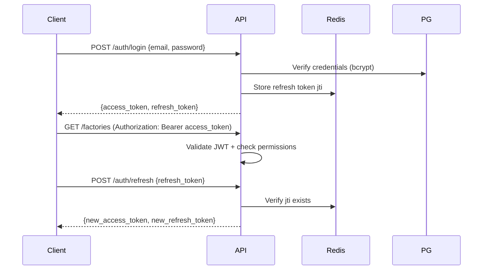

# ADR-005 — Authentication Strategy (JWT)

**Statut :** Accepté  
**Date :** 2025-06-27

## Contexte

L'API doit être sécurisée pour un contexte multi-tenant SaaS. Les clients incluent un dashboard web (futur) et une app Windows — tous doivent s'authentifier via la même API.

## Décision

**JWT avec access token + refresh token**, stockage refresh en Redis.

### Token Structure

**Access Token** (15 min TTL)
```json
{
  "sub": "user_uuid",
  "tenant_id": "tenant_uuid",
  "roles": ["operator"],
  "permissions": ["factory:read", "machine:read"],
  "type": "access",
  "exp": 1719500000
}
```

**Refresh Token** (7 jours TTL)
```json
{
  "sub": "user_uuid",
  "type": "refresh",
  "jti": "unique_token_id",
  "exp": 1720100000
}
```

### Flux



### Sécurité

| Mesure | Implémentation |
|--------|----------------|
| Password hashing | bcrypt (cost 12) |
| Rate limiting | Redis, 5 login/min/IP |
| Token rotation | Refresh token one-time use |
| WebSocket auth | JWT en query param `?token=` |
| HTTPS | Obligatoire en production |

## Conséquences

- Stateless API (scalable)
- Refresh en Redis permet revocation immédiate
- Permissions dans le JWT évite une DB lookup à chaque requête (cache 15 min)
