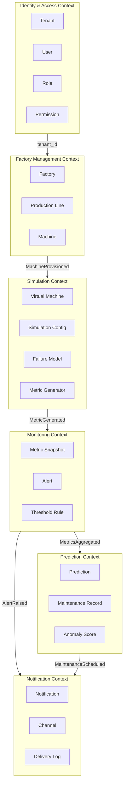
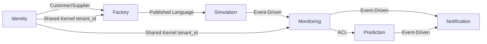

# Bounded Contexts — Domain-Driven Design

## Vue d'ensemble

Digital Twin Factory est divisé en **6 Bounded Contexts** avec des responsabilités claires et des interfaces bien définies.



## Context 1 — Identity & Access

**Responsabilité :** Authentification, autorisation, gestion des tenants et utilisateurs.

| Aggregate Root | Entités | Value Objects |
|----------------|---------|---------------|
| `Tenant` | TenantSettings | TenantSlug, TenantName |
| `User` | UserRole | Email, PasswordHash |
| `Role` | RolePermission | PermissionName |

**Domain Events :**
- `TenantCreated`
- `UserRegistered`
- `UserLoggedIn`
- `RoleAssigned`

---

## Context 2 — Factory Management

**Responsabilité :** Gestion du catalogue d'usines, lignes de production et machines.

| Aggregate Root | Entités | Value Objects |
|----------------|---------|---------------|
| `Factory` | ProductionLine | FactoryName, Location, FactoryStatus |
| `ProductionLine` | Machine | LineName, LineCapacity |
| `Machine` | — | MachineType, MachineStatus, SimulationConfig |

**Types de machines :**
- `CNC_MILL` — Fraiseuse CNC
- `ROBOT_ARM` — Robot industriel
- `CONVEYOR` — Convoyeur
- `PRESS` — Presse hydraulique
- `WELDER` — Soudeur automatique
- `PACKAGING` — Machine d'emballage

**Domain Events :**
- `FactoryCreated`
- `FactoryStatusChanged`
- `ProductionLineAdded`
- `MachineProvisioned`
- `MachineDecommissioned`

---

## Context 3 — Simulation

**Responsabilité :** Moteur de simulation des machines virtuelles — génération de métriques réalistes.

| Concept | Description |
|---------|-------------|
| `VirtualMachine` | Machine en cours de simulation |
| `FailureModel` | Modèle probabiliste de panne |
| `MetricGenerator` | Génère température, vibration, etc. |
| `DegradationCurve` | Courbe de dégradation progressive |

**Modèle de simulation :**

```
température_base + bruit_gaussien + dégradation(temps)
vibration = f(température, cadence, état_machine)
consommation = f(cadence, type_machine)
cadence = cadence_nominal × facteur_dégradation
```

**États machine :**
- `RUNNING` — En production
- `IDLE` — En veille
- `DEGRADED` — Performance réduite
- `FAILURE` — Panne
- `MAINTENANCE` — En maintenance
- `OFFLINE` — Hors service

**Domain Events :**
- `SimulationStarted`
- `MetricGenerated`
- `MachineStatusChanged`
- `MachineFailed`
- `SimulationStopped`

---

## Context 4 — Monitoring

**Responsabilité :** Collecte, agrégation des métriques et gestion des alertes.

| Aggregate Root | Description |
|----------------|-------------|
| `Alert` | Alerte active ou historique |
| `ThresholdRule` | Règle de seuil configurable |

**Types d'alertes :**
- `TEMPERATURE_HIGH` — Surchauffe
- `VIBRATION_CRITICAL` — Vibration anormale
- `POWER_SPIKE` — Pic de consommation
- `PRODUCTION_DROP` — Chute de cadence
- `MACHINE_FAILURE` — Panne machine
- `PREDICTIVE_WARNING` — Alerte prédictive

**Sévérités :** `INFO` → `WARNING` → `CRITICAL` → `EMERGENCY`

**Domain Events :**
- `AlertRaised`
- `AlertAcknowledged`
- `AlertResolved`
- `MetricsAggregated`

---

## Context 5 — Prediction

**Responsabilité :** Maintenance prédictive, détection d'anomalies, scoring ML.

| Concept | Description |
|---------|-------------|
| `Prediction` | Prédiction de panne/surchauffe |
| `AnomalyScore` | Score d'anomalie 0-1 |
| `MaintenanceRecord` | Ticket de maintenance |

**Types de prédiction :**
- `FAILURE_WITHIN_24H`
- `FAILURE_WITHIN_7D`
- `OVERHEAT_RISK`
- `MAINTENANCE_DUE`
- `ANOMALY_DETECTED`

**Domain Events :**
- `AnomalyDetected`
- `FailurePredicted`
- `MaintenanceScheduled`
- `MaintenanceCompleted`

---

## Context 6 — Notification

**Responsabilité :** Distribution des alertes et notifications aux utilisateurs.

| Channel | Usage |
|---------|-------|
| `IN_APP` | Notification dashboard |
| `EMAIL` | Email SMTP |
| `WEBHOOK` | HTTP callback |
| `SLACK` | Slack integration (futur) |

**Domain Events :**
- `NotificationSent`
- `NotificationFailed`
- `NotificationDelivered`

---

## Context Map — Relations



| Relation | Type | Description |
|----------|------|-------------|
| Identity → Factory | Customer/Supplier | tenant_id propagé |
| Factory → Simulation | Published Language | MachineProvisioned event |
| Simulation → Monitoring | Event-Driven | MetricGenerated via Redis |
| Monitoring → Prediction | ACL | Métriques agrégées |
| Monitoring → Notification | Event-Driven | AlertRaised |
| Prediction → Notification | Event-Driven | MaintenanceScheduled |
