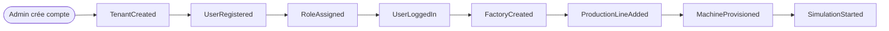
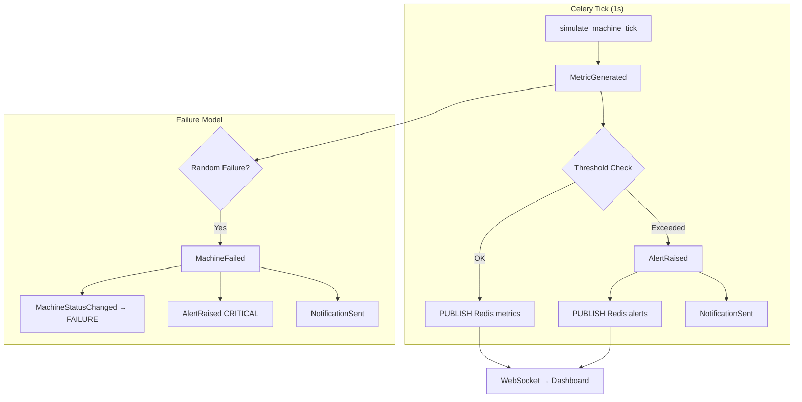
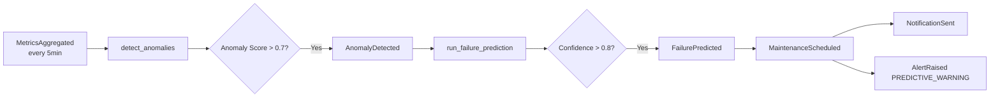

# Event Storming — Digital Twin Factory

## Méthodologie

Event Storming appliqué aux 3 flux métier principaux :
1. **Onboarding Tenant** — Création organisation + première usine
2. **Simulation Live** — Cycle de vie d'une machine virtuelle
3. **Maintenance Prédictive** — Détection → Prédiction → Intervention

---

## Flux 1 — Onboarding Tenant

| Event | Command | Aggregate | Policy |
|-------|---------|-----------|--------|
| `TenantCreated` | `CreateTenantCommand` | Tenant | — |
| `UserRegistered` | `RegisterUserCommand` | User | tenant must exist |
| `RoleAssigned` | `AssignRoleCommand` | User | role must exist |
| `UserLoggedIn` | `LoginCommand` | User | credentials valid |
| `FactoryCreated` | `CreateFactoryCommand` | Factory | user has factory:write |
| `MachineProvisioned` | `ProvisionMachineCommand` | Machine | factory must exist |

---

## Flux 2 — Simulation Live (Hot Path)

### Métriques générées chaque tick

| Métrique | Unité | Plage normale | Seuil WARNING | Seuil CRITICAL |
|----------|-------|---------------|---------------|----------------|
| `temperature` | °C | 20–80 | > 85 | > 95 |
| `vibration` | mm/s | 0–5 | > 7 | > 12 |
| `power_consumption` | kW | 1–50 | > 60 | > 80 |
| `production_rate` | units/min | 80–100% nominal | < 70% | < 50% |

---

## Flux 3 — Maintenance Prédictive

---

## Catalogue complet des Domain Events

### Identity Context
| Event | Payload clé |
|-------|-------------|
| `TenantCreated` | tenant_id, name, slug |
| `UserRegistered` | user_id, tenant_id, email |
| `UserLoggedIn` | user_id, tenant_id, ip |
| `RoleAssigned` | user_id, role_id |
| `UserDeactivated` | user_id |

### Factory Context
| Event | Payload clé |
|-------|-------------|
| `FactoryCreated` | factory_id, tenant_id, name |
| `FactoryStatusChanged` | factory_id, old_status, new_status |
| `ProductionLineAdded` | line_id, factory_id |
| `MachineProvisioned` | machine_id, type, config |
| `MachineDecommissioned` | machine_id |

### Simulation Context
| Event | Payload clé |
|-------|-------------|
| `SimulationStarted` | machine_id |
| `MetricGenerated` | machine_id, metrics dict |
| `MachineStatusChanged` | machine_id, status |
| `MachineFailed` | machine_id, failure_type |
| `SimulationStopped` | machine_id |

### Monitoring Context
| Event | Payload clé |
|-------|-------------|
| `AlertRaised` | alert_id, machine_id, severity, type |
| `AlertAcknowledged` | alert_id, user_id |
| `AlertResolved` | alert_id, resolution |
| `MetricsAggregated` | machine_id, period, aggregates |

### Prediction Context
| Event | Payload clé |
|-------|-------------|
| `AnomalyDetected` | machine_id, score, features |
| `FailurePredicted` | machine_id, confidence, horizon |
| `MaintenanceScheduled` | record_id, machine_id, scheduled_at |
| `MaintenanceCompleted` | record_id, completed_at |

### Notification Context
| Event | Payload clé |
|-------|-------------|
| `NotificationSent` | notification_id, channel, recipient |
| `NotificationDelivered` | notification_id |
| `NotificationFailed` | notification_id, error |

---

## Policies (règles automatiques)

| Policy | Trigger | Action |
|--------|---------|--------|
| `StartSimulationOnProvision` | `MachineProvisioned` | Start Celery periodic task |
| `RaiseAlertOnThreshold` | `MetricGenerated` | Check thresholds → `AlertRaised` |
| `NotifyOnCriticalAlert` | `AlertRaised` (CRITICAL) | `NotificationSent` immédiat |
| `PredictOnAnomaly` | `AnomalyDetected` | Trigger `run_failure_prediction` |
| `ScheduleMaintenanceOnPrediction` | `FailurePredicted` (>0.8) | `MaintenanceScheduled` |
| `StopSimulationOnFailure` | `MachineFailed` | Stop tick, set status FAILURE |
