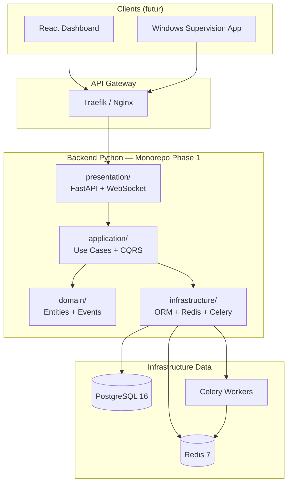
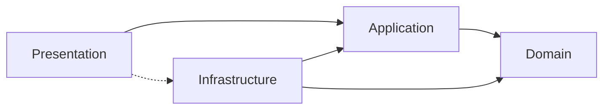
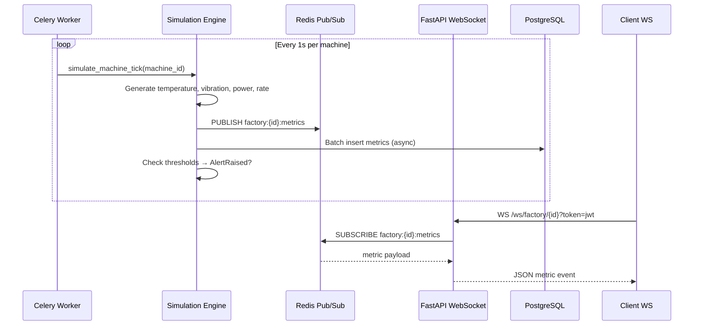

# Architecture Overview — Digital Twin Factory

## Contexte système

Digital Twin Factory est une plateforme SaaS multi-tenant qui simule des usines industrielles en temps réel. Chaque tenant peut créer des usines, provisionner des machines virtuelles et observer leur comportement via des métriques live, des alertes et des prédictions de maintenance.

## Architecture globale

## Évolution microservices (Phase 2)

Le monorepo initial évolue vers des services déployables indépendamment :

| Service | Responsabilité | Port |
|---------|----------------|------|
| `auth-service` | JWT, RBAC, Multi-tenancy | 8001 |
| `factory-service` | Usines, lignes, machines | 8002 |
| `simulation-service` | Moteur de simulation virtuelle | 8003 |
| `monitoring-service` | Métriques, alertes, dashboard WS | 8004 |
| `prediction-service` | ML, maintenance prédictive | 8005 |
| `notification-service` | Email, webhook, in-app | 8006 |

## Clean Architecture — Règles de dépendance

**Règles :**
1. `domain/` ne dépend de rien (pure Python)
2. `application/` dépend uniquement de `domain/`
3. `infrastructure/` implémente les interfaces définies dans `domain/` et `application/`
4. `presentation/` orchestre les use cases via `application/`

## Flux de données temps réel

## ADRs (Architecture Decision Records)

| ADR | Décision |
|-----|----------|
| [ADR-001](ADR-001-clean-architecture.md) | Clean Architecture + DDD |
| [ADR-002](ADR-002-event-driven-architecture.md) | Event-Driven avec Redis |
| [ADR-003](ADR-003-multi-tenancy.md) | Multi-tenancy par tenant_id + RLS |
| [ADR-004](ADR-004-cqrs-strategy.md) | CQRS partiel |
| [ADR-005](ADR-005-authentication-strategy.md) | JWT access + refresh |

## Qualité et observabilité

| Aspect | Solution |
|--------|----------|
| Logging | structlog (JSON) + correlation_id |
| Monitoring | Prometheus metrics + health checks |
| Tracing | OpenTelemetry (futur) |
| Error handling | Domain exceptions → HTTP mapping |
| API docs | OpenAPI 3.1 auto-généré FastAPI |
