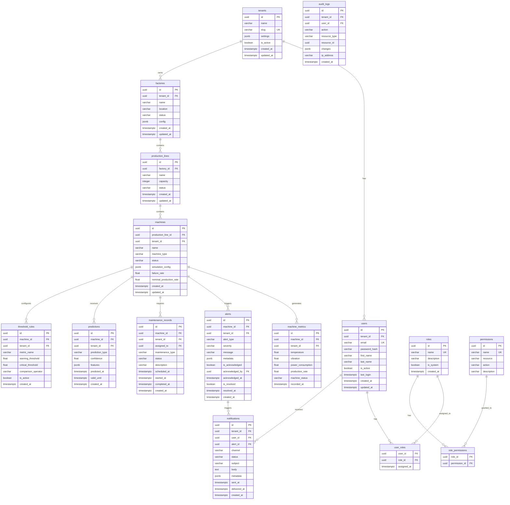

# Modèle Relationnel — PostgreSQL

## Diagramme ERD



## Index stratégiques

```sql
-- Multi-tenancy (toutes les tables métier)
CREATE INDEX idx_factories_tenant_id ON factories(tenant_id);
CREATE INDEX idx_machines_tenant_id ON machines(tenant_id);
CREATE INDEX idx_machine_metrics_tenant_id ON machine_metrics(tenant_id);

-- Métriques temps série (lectures fréquentes)
CREATE INDEX idx_metrics_machine_recorded ON machine_metrics(machine_id, recorded_at DESC);
CREATE INDEX idx_metrics_tenant_recorded ON machine_metrics(tenant_id, recorded_at DESC);

-- Alertes actives
CREATE INDEX idx_alerts_active ON alerts(tenant_id, is_resolved, created_at DESC)
    WHERE is_resolved = false;

-- Prédictions valides
CREATE INDEX idx_predictions_valid ON predictions(machine_id, valid_until DESC)
    WHERE valid_until > NOW();
```

## Row Level Security

```sql
ALTER TABLE factories ENABLE ROW LEVEL SECURITY;
ALTER TABLE machines ENABLE ROW LEVEL SECURITY;
ALTER TABLE machine_metrics ENABLE ROW LEVEL SECURITY;
ALTER TABLE alerts ENABLE ROW LEVEL SECURITY;

CREATE POLICY tenant_isolation_factories ON factories
    USING (tenant_id = current_setting('app.current_tenant_id', true)::uuid);

CREATE POLICY tenant_isolation_machines ON machines
    USING (tenant_id = current_setting('app.current_tenant_id', true)::uuid);
```

## Stratégie de rétention des données

| Table | Rétention | Stratégie |
|-------|-----------|-----------|
| `machine_metrics` | 90 jours raw | Partition par mois + agrégation |
| `alerts` | 1 an | Archivage cold storage |
| `predictions` | 6 mois | — |
| `audit_logs` | 2 ans | Compliance |
| `notifications` | 30 jours | — |

## Enums PostgreSQL

```sql
CREATE TYPE factory_status AS ENUM ('ACTIVE', 'INACTIVE', 'MAINTENANCE');
CREATE TYPE machine_type AS ENUM ('CNC_MILL', 'ROBOT_ARM', 'CONVEYOR', 'PRESS', 'WELDER', 'PACKAGING');
CREATE TYPE machine_status AS ENUM ('RUNNING', 'IDLE', 'DEGRADED', 'FAILURE', 'MAINTENANCE', 'OFFLINE');
CREATE TYPE alert_severity AS ENUM ('INFO', 'WARNING', 'CRITICAL', 'EMERGENCY');
CREATE TYPE alert_type AS ENUM ('TEMPERATURE_HIGH', 'VIBRATION_CRITICAL', 'POWER_SPIKE', 'PRODUCTION_DROP', 'MACHINE_FAILURE', 'PREDICTIVE_WARNING');
CREATE TYPE prediction_type AS ENUM ('FAILURE_WITHIN_24H', 'FAILURE_WITHIN_7D', 'OVERHEAT_RISK', 'MAINTENANCE_DUE', 'ANOMALY_DETECTED');
CREATE TYPE maintenance_status AS ENUM ('SCHEDULED', 'IN_PROGRESS', 'COMPLETED', 'CANCELLED');
CREATE TYPE notification_channel AS ENUM ('IN_APP', 'EMAIL', 'WEBHOOK', 'SLACK');
CREATE TYPE notification_status AS ENUM ('PENDING', 'SENT', 'DELIVERED', 'FAILED');
```

## simulation_config JSONB (exemple)

```json
{
  "temperature": {
    "base": 45.0,
    "noise_std": 2.0,
    "degradation_rate": 0.001
  },
  "vibration": {
    "base": 1.5,
    "noise_std": 0.3
  },
  "power": {
    "nominal_kw": 25.0,
    "efficiency_factor": 0.92
  },
  "production": {
    "nominal_rate": 100,
    "unit": "pieces/min"
  },
  "failure": {
    "mtbf_hours": 720,
    "mttr_hours": 4
  }
}
```
