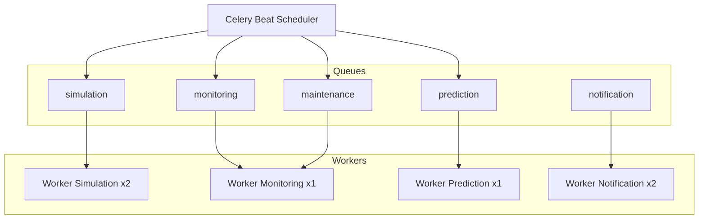

# Celery Tasks — Digital Twin Factory

## Architecture workers



## Catalogue des tâches

### Queue: `simulation`

#### `simulate_machine_tick`
| Attribut | Valeur |
|----------|--------|
| Trigger | Celery Beat — 1s per active machine |
| Args | `machine_id`, `tenant_id` |
| Retry | 3x, backoff 1s |
| Timeout | 5s |

**Actions :**
1. Acquire distributed lock `lock:machine:{id}`
2. Load machine config from DB/cache
3. Generate metrics (temperature, vibration, power, rate)
4. Apply failure model (random + degradation)
5. Update machine status if needed
6. Batch insert metrics PostgreSQL
7. SET Redis latest metric cache
8. PUBLISH `tenant:{tid}:factory:{fid}:metrics`
9. Check thresholds → dispatch `check_thresholds` if needed
10. Release lock

#### `start_machine_simulation`
Trigger : `MachineProvisioned` event
- Register periodic task in Beat schedule
- Set machine status RUNNING

#### `stop_machine_simulation`
Trigger : `MachineFailed` or manual stop
- Remove from Beat schedule
- Set machine status OFFLINE

---

### Queue: `monitoring`

#### `check_thresholds`
| Attribut | Valeur |
|----------|--------|
| Trigger | Chained from `simulate_machine_tick` |
| Args | `machine_id`, `tenant_id`, `metrics` dict |

**Actions :**
1. Load threshold_rules for machine
2. Compare each metric vs thresholds
3. If exceeded → create Alert aggregate
4. PUBLISH alert channel
5. If CRITICAL → dispatch `send_notification`

#### `aggregate_metrics`
| Attribut | Valeur |
|----------|--------|
| Trigger | Celery Beat — every 5 min |
| Args | `tenant_id` (optional, all if None) |

**Actions :**
1. Aggregate raw metrics → 5min buckets
2. Store aggregates in PostgreSQL
3. Emit `MetricsAggregated` event
4. Dispatch `detect_anomalies` for machines with degradation

#### `cleanup_old_metrics`
| Attribut | Valeur |
|----------|--------|
| Trigger | Celery Beat — daily 02:00 UTC |
| Retention | 90 days raw metrics |

---

### Queue: `prediction`

#### `detect_anomalies`
| Attribut | Valeur |
|----------|--------|
| Trigger | Chained from `aggregate_metrics` |
| Args | `machine_id`, `tenant_id` |

**Actions :**
1. Load last 24h aggregated metrics
2. Compute anomaly score (z-score + isolation forest)
3. If score > 0.7 → emit `AnomalyDetected`
4. Dispatch `run_failure_prediction`

#### `run_failure_prediction`
| Attribut | Valeur |
|----------|--------|
| Trigger | `AnomalyDetected` or Beat every 15min |
| Args | `machine_id`, `tenant_id` |

**Actions :**
1. Load feature vector (temp, vibration, power trends)
2. Run ML model (scikit-learn RandomForest)
3. If confidence > 0.8 → create Prediction aggregate
4. Emit `FailurePredicted`
5. Dispatch `schedule_maintenance`

#### `schedule_maintenance`
Trigger : `FailurePredicted`
- Create MaintenanceRecord aggregate
- Dispatch `send_notification` to maintenance engineers

---

### Queue: `notification`

#### `send_notification`
| Attribut | Valeur |
|----------|--------|
| Trigger | AlertRaised, MaintenanceScheduled |
| Args | `tenant_id`, `user_ids`, `channel`, `payload` |
| Retry | 3x, backoff 5s |

**Channels :**
- `IN_APP` → Redis pub/sub → WebSocket
- `EMAIL` → SMTP async
- `WEBHOOK` → HTTP POST with retry

---

### Queue: `maintenance`

#### `cleanup_expired_tokens`
Trigger : Beat daily 03:00 UTC
- Remove expired refresh tokens from Redis

#### `generate_daily_report`
Trigger : Beat daily 06:00 UTC per tenant
- Aggregate daily stats → email report to tenant_admin

## Celery Beat Schedule

```python
# Conceptuel — implémentation future
beat_schedule = {
    "aggregate-metrics": {
        "task": "aggregate_metrics",
        "schedule": 300.0,  # 5 min
    },
    "run-predictions": {
        "task": "run_failure_prediction_all",
        "schedule": 900.0,  # 15 min
    },
    "cleanup-metrics": {
        "task": "cleanup_old_metrics",
        "schedule": crontab(hour=2, minute=0),
    },
    "cleanup-tokens": {
        "task": "cleanup_expired_tokens",
        "schedule": crontab(hour=3, minute=0),
    },
    "daily-report": {
        "task": "generate_daily_report",
        "schedule": crontab(hour=6, minute=0),
    },
}
```

## Configuration workers

| Worker | Queues | Concurrency | Memory limit |
|--------|--------|-------------|--------------|
| simulation-worker | simulation | 4 | 512MB |
| monitoring-worker | monitoring, maintenance | 2 | 256MB |
| prediction-worker | prediction | 2 | 1GB (ML models) |
| notification-worker | notification | 4 | 256MB |

## Idempotence et fiabilité

- Toutes les tasks ont un `task_id` unique basé sur `(task_name, entity_id, timestamp_bucket)`
- Dead letter queue pour tasks échouées après 3 retries
- Monitoring : Flower UI en dev, Prometheus metrics en prod
