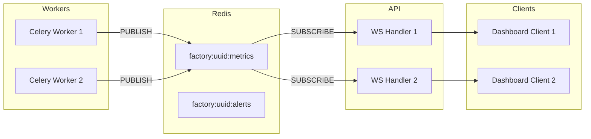
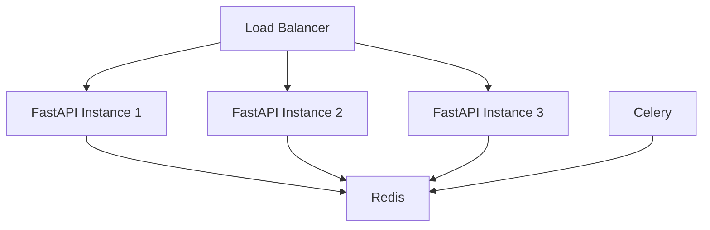

# Architecture WebSocket — Temps Réel

## Vue d'ensemble

Les clients se connectent via WebSocket pour recevoir les métriques et alertes en push. L'architecture utilise Redis Pub/Sub comme relais entre les workers Celery (simulation) et les handlers FastAPI WebSocket.



## Endpoints WebSocket

| Endpoint | Description | Auth |
|----------|-------------|------|
| `WS /ws/factory/{factory_id}` | Métriques + alertes usine | JWT query param |
| `WS /ws/machine/{machine_id}` | Métriques machine seule | JWT query param |
| `WS /ws/alerts` | Toutes alertes tenant | JWT query param |

## Connexion

```
ws://localhost:8000/ws/factory/{factory_id}?token={access_token}
```

## Messages serveur → client

### Metric Event
```json
{
  "type": "metric",
  "factory_id": "uuid",
  "machine_id": "uuid",
  "data": {
    "temperature": 47.3,
    "vibration": 1.8,
    "power_consumption": 24.5,
    "production_rate": 98.2,
    "status": "RUNNING"
  },
  "timestamp": "2025-06-27T10:30:01.123Z"
}
```

### Alert Event
```json
{
  "type": "alert",
  "alert_id": "uuid",
  "machine_id": "uuid",
  "severity": "CRITICAL",
  "alert_type": "TEMPERATURE_HIGH",
  "message": "Temperature exceeded 95°C",
  "timestamp": "2025-06-27T10:30:01.123Z"
}
```

### Status Event
```json
{
  "type": "status",
  "machine_id": "uuid",
  "old_status": "RUNNING",
  "new_status": "FAILURE",
  "timestamp": "2025-06-27T10:30:01.123Z"
}
```

### Heartbeat
```json
{ "type": "ping", "timestamp": "2025-06-27T10:30:01.123Z" }
```

## Messages client → serveur

```json
{ "type": "subscribe", "channels": ["metrics", "alerts"] }
{ "type": "unsubscribe", "channels": ["alerts"] }
{ "type": "pong" }
```

## Gestion des connexions

| Aspect | Stratégie |
|--------|-----------|
| Auth | JWT validé à la connexion, pas de re-auth |
| Reconnexion | Client reconnect + resubscribe automatique |
| Heartbeat | Ping serveur toutes les 30s, timeout 60s |
| Max connexions/tenant | 100 (configurable) |
| Backpressure | Drop messages si client lent (> 1000 queued) |
| Multi-instance | Redis Pub/Sub permet scaling horizontal API |

## Scaling horizontal



Toutes les instances API subscribe les mêmes Redis channels — chaque instance forward uniquement à ses clients connectés.

## Sécurité WebSocket

1. JWT obligatoire (query param ou header `Sec-WebSocket-Protocol`)
2. Vérification `tenant_id` du JWT vs `factory_id` demandé
3. Rate limit connexions : 10/min/IP
4. Pas de données cross-tenant même en erreur
