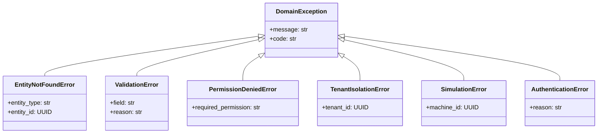

# Error Handling Strategy — Digital Twin Factory

## Hiérarchie des exceptions



## Mapping Domain → HTTP

| Exception | HTTP Status | Error Code |
|-------------|-------------|------------|
| `EntityNotFoundError` | 404 | `NOT_FOUND` |
| `ValidationError` | 400 | `VALIDATION_ERROR` |
| `PermissionDeniedError` | 403 | `FORBIDDEN` |
| `TenantIsolationError` | 403 | `FORBIDDEN` |
| `AuthenticationError` | 401 | `UNAUTHORIZED` |
| `ConflictError` | 409 | `CONFLICT` |
| `RateLimitError` | 429 | `RATE_LIMITED` |
| `SimulationError` | 500 | `SIMULATION_ERROR` |
| Unhandled | 500 | `INTERNAL_ERROR` |

## Format de réponse erreur

```json
{
  "error": {
    "code": "VALIDATION_ERROR",
    "message": "Machine type is invalid",
    "details": [
      {
        "field": "machine_type",
        "message": "Must be one of: CNC_MILL, ROBOT_ARM, CONVEYOR, PRESS, WELDER, PACKAGING"
      }
    ],
    "correlation_id": "abc-123-def-456"
  }
}
```

## FastAPI Exception Handlers

```python
# Conceptuel — structure cible
@app.exception_handler(DomainException)
async def domain_exception_handler(request, exc):
    return JSONResponse(
        status_code=STATUS_MAP[type(exc)],
        content={"error": format_error(exc, get_correlation_id())}
    )

@app.exception_handler(Exception)
async def unhandled_exception_handler(request, exc):
    logger.error("unhandled_exception", exc_info=exc)
    return JSONResponse(status_code=500, content={"error": ...})
```

## Validation (Pydantic)

Les erreurs Pydantic sont transformées en `ValidationError` domain avant le handler HTTP :

```json
{
  "error": {
    "code": "VALIDATION_ERROR",
    "message": "Request validation failed",
    "details": [
      { "field": "email", "message": "value is not a valid email" },
      { "field": "password", "message": "ensure this value has at least 8 characters" }
    ]
  }
}
```

## Celery Error Handling

| Scénario | Action |
|----------|--------|
| Task timeout | Retry 3x avec backoff |
| DB connection lost | Retry 5x, exponential backoff |
| Redis unavailable | Fail fast, alert ops |
| ML model error | Log ERROR, skip machine |
| Notification failed | Retry 3x, dead letter queue |

## Circuit Breaker (futur)

Pour les appels externes (SMTP, Webhook) :
- Open après 5 échecs consécutifs
- Half-open après 30s
- Close après 3 succès

## Error Monitoring

- Sentry pour exceptions non gérées
- Prometheus counter `errors_total{code, service}`
- Alert si error rate > 1% sur 5 min
