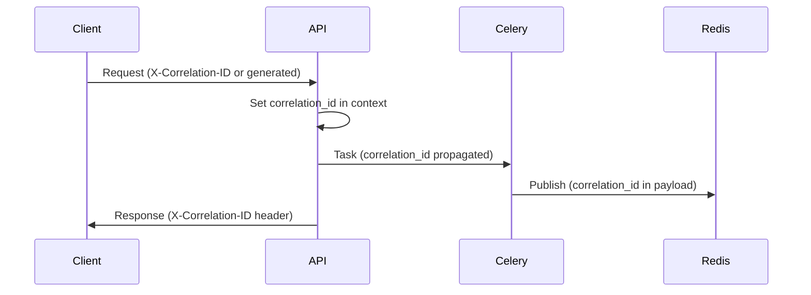

# Logging Strategy — Digital Twin Factory

## Stack

| Composant | Technologie |
|-----------|-------------|
| Logger | `structlog` |
| Format | JSON structuré |
| Correlation | `correlation_id` (UUID) |
| Niveaux | DEBUG, INFO, WARNING, ERROR, CRITICAL |

## Format de log standard

```json
{
  "timestamp": "2025-06-27T10:30:01.123Z",
  "level": "INFO",
  "logger": "src.application.handlers.create_factory",
  "message": "Factory created successfully",
  "correlation_id": "abc-123-def-456",
  "tenant_id": "uuid",
  "user_id": "uuid",
  "event": "factory.created",
  "factory_id": "uuid",
  "duration_ms": 45
}
```

## Correlation ID



- Généré côté client ou serveur si absent
- Propagé via `contextvars` dans FastAPI
- Inclus dans tous les logs, audit_logs, error responses
- Header response : `X-Correlation-ID`

## Niveaux par composant

| Composant | Niveau dev | Niveau prod |
|-----------|------------|-------------|
| API requests | INFO | INFO |
| DB queries | DEBUG | WARNING |
| Redis ops | DEBUG | WARNING |
| Celery tasks | INFO | INFO |
| Simulation tick | DEBUG | INFO |
| Security events | INFO | INFO |
| Errors | ERROR | ERROR |

## Events loggés (INFO)

| Event | Champs additionnels |
|-------|---------------------|
| `request.received` | method, path, ip |
| `request.completed` | status_code, duration_ms |
| `user.login` | user_id, ip |
| `user.login_failed` | email, ip, reason |
| `factory.created` | factory_id |
| `machine.provisioned` | machine_id, type |
| `alert.raised` | alert_id, severity |
| `simulation.tick` | machine_id, metrics_summary |
| `celery.task.started` | task_name, task_id |
| `celery.task.completed` | task_name, duration_ms |
| `websocket.connected` | factory_id, client_count |
| `websocket.disconnected` | factory_id, reason |

## Ce qui n'est JAMAIS loggé

- Passwords (même hashés)
- JWT tokens complets
- Refresh tokens
- Données personnelles non nécessaires

## Agrégation (production)

| Outil | Usage |
|-------|-------|
| Loki + Grafana | Log aggregation |
| Elasticsearch | Search & analytics |
| Sentry | Error tracking |

## Configuration

```python
# Conceptuel
LOGGING_CONFIG = {
    "processors": [
        "merge_contextvars",
        "add_log_level",
        "TimeStamper(fmt='iso')",
        "JSONRenderer()"
    ],
    "log_level": "INFO",  # env: LOG_LEVEL
}
```
