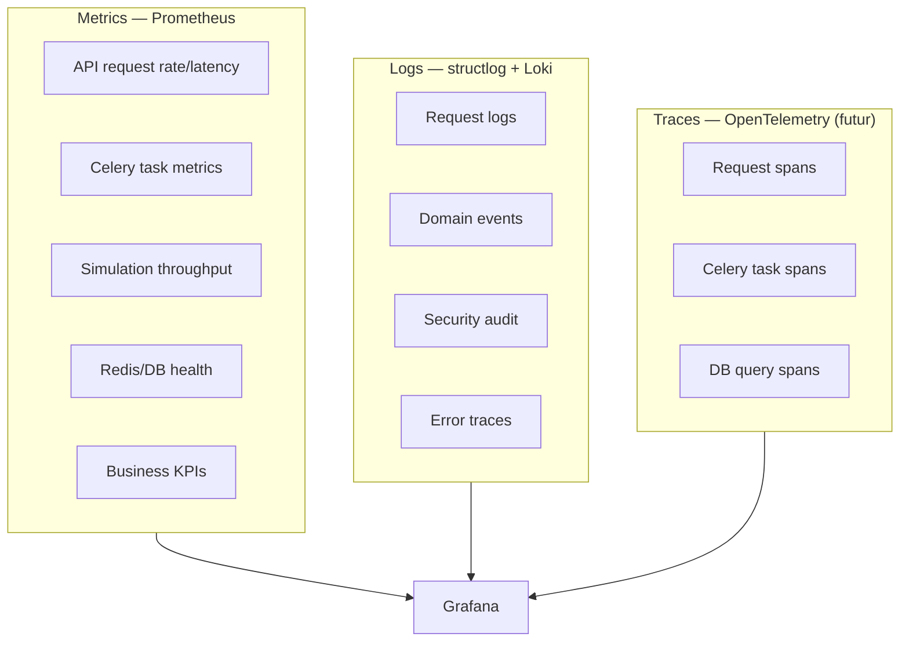

# Monitoring Architecture — Digital Twin Factory

## Observabilité — 3 piliers



## Health Checks

### GET `/health`
```json
{
  "status": "healthy",
  "version": "1.0.0",
  "environment": "production",
  "uptime_seconds": 86400,
  "services": {
    "database": { "status": "ok", "latency_ms": 2 },
    "redis": { "status": "ok", "latency_ms": 1 },
    "celery": { "status": "ok", "active_workers": 4 }
  }
}
```

### GET `/health/ready` — Kubernetes readiness
### GET `/health/live` — Kubernetes liveness

## Métriques Prometheus

### API Metrics
| Metric | Type | Description |
|--------|------|-------------|
| `http_requests_total` | Counter | Par method, path, status |
| `http_request_duration_seconds` | Histogram | Latence P50/P95/P99 |
| `websocket_connections_active` | Gauge | Connexions WS actives |
| `websocket_messages_sent_total` | Counter | Messages WS envoyés |

### Business Metrics
| Metric | Type | Description |
|--------|------|-------------|
| `machines_active_total` | Gauge | Machines en simulation |
| `metrics_generated_total` | Counter | Métriques générées |
| `alerts_raised_total` | Counter | Par severity, type |
| `predictions_generated_total` | Counter | Prédictions ML |
| `simulation_ticks_per_second` | Gauge | Throughput simulation |

### Infrastructure Metrics
| Metric | Type | Description |
|--------|------|-------------|
| `celery_tasks_total` | Counter | Par task, status |
| `celery_task_duration_seconds` | Histogram | Durée tasks |
| `redis_pubsub_messages_total` | Counter | Messages pub/sub |
| `db_query_duration_seconds` | Histogram | Latence DB |

## Dashboards Grafana (cibles)

### Dashboard 1 — Platform Health
- API latency P95
- Error rate
- Active WebSocket connections
- Celery queue depths

### Dashboard 2 — Factory Operations
- Machines par status (RUNNING, FAILURE, etc.)
- Alertes actives par severity
- Métriques throughput (metrics/sec)
- Prédictions en cours

### Dashboard 3 — Business KPIs
- Uptime machines (%)
- MTBF / MTTR
- Alertes résolues / non résolues
- Maintenance préventive vs corrective

## Alerting Rules

| Alerte | Condition | Severity |
|--------|-----------|----------|
| API Error Rate High | > 1% errors/5min | Critical |
| API Latency High | P95 > 500ms | Warning |
| Celery Queue Backlog | > 1000 pending | Warning |
| Simulation Stalled | 0 ticks/60s | Critical |
| Redis Memory High | > 80% | Warning |
| DB Connection Pool Exhausted | > 90% | Critical |
| Machine Failure Spike | > 5 failures/10min | Warning |

## SLIs / SLOs

| SLI | SLO | Measurement |
|-----|-----|-------------|
| API Availability | 99.9% | Uptime health check |
| API Latency P95 | < 200ms | Prometheus histogram |
| WebSocket Latency | < 100ms | metric→client timestamp |
| Simulation Tick Rate | > 0.95/s per machine | Celery metrics |
| Alert Delivery | < 5s | alert_created→notification_sent |
