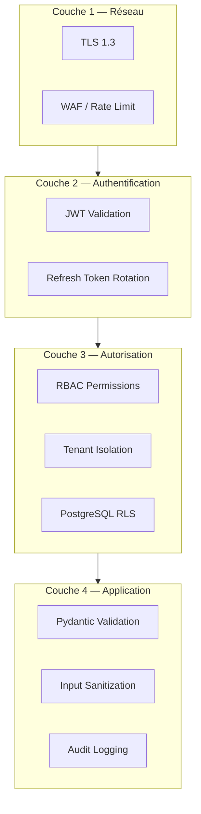

# Security Strategy — Digital Twin Factory

## Principes OWASP

| Risque OWASP | Mitigation |
|--------------|------------|
| Broken Access Control | RBAC + tenant isolation + RLS |
| Cryptographic Failures | bcrypt passwords, HS256 JWT, TLS |
| Injection | SQLAlchemy ORM, Pydantic validation |
| Insecure Design | Threat modeling, ADRs |
| Security Misconfiguration | Docker non-root, env vars |
| Vulnerable Components | pip-audit CI, dependabot |
| Auth Failures | Rate limiting, account lockout |
| Data Integrity | Audit logs, correlation IDs |
| Logging Failures | structlog JSON, no secrets in logs |
| SSRF | URL validation on webhooks |

## Couches de sécurité



## JWT Security

| Paramètre | Valeur |
|-----------|--------|
| Algorithm | HS256 (dev) / RS256 (prod) |
| Access TTL | 15 minutes |
| Refresh TTL | 7 days |
| Rotation | One-time use refresh tokens |
| Storage client | Memory (pas localStorage) |
| Revocation | Redis blacklist + refresh delete |

## Password Policy

- Minimum 8 caractères
- Au moins 1 majuscule, 1 minuscule, 1 chiffre
- Hashing : bcrypt cost factor 12
- Pas de stockage plaintext
- Pas de password dans les logs

## API Security Headers

```
Strict-Transport-Security: max-age=31536000
X-Content-Type-Options: nosniff
X-Frame-Options: DENY
Content-Security-Policy: default-src 'self'
X-Request-ID: {correlation_id}
```

## Audit Trail

Toutes les actions sensibles sont loggées dans `audit_logs` :

| Action | Ressource |
|--------|-----------|
| `user.login` | User |
| `user.login_failed` | User |
| `factory.create` | Factory |
| `machine.provision` | Machine |
| `alert.acknowledge` | Alert |
| `maintenance.complete` | MaintenanceRecord |
| `user.role_assign` | User |

Format :
```json
{
  "tenant_id": "uuid",
  "user_id": "uuid",
  "action": "machine.provision",
  "resource_type": "Machine",
  "resource_id": "uuid",
  "changes": { "machine_type": "CNC_MILL" },
  "ip_address": "192.168.1.1",
  "correlation_id": "abc-123"
}
```

## Secrets Management

| Environnement | Solution |
|---------------|----------|
| Development | `.env` file (gitignored) |
| CI | GitHub Secrets |
| Production | Kubernetes Secrets / Vault |

**Secrets jamais dans le code :**
- `JWT_SECRET_KEY`
- `DATABASE_URL` (password)
- `SMTP_PASSWORD`
- `WEBHOOK_SECRET`

## Dependency Scanning

CI pipeline inclut :
- `pip-audit` — vulnérabilités Python packages
- `bandit` — analyse statique sécurité Python
- Dependabot — mises à jour automatiques

## Threat Model — Top Risks

| Threat | Impact | Mitigation |
|--------|--------|------------|
| Cross-tenant data leak | Critique | RLS + tenant_id validation |
| JWT theft | Élevé | Short TTL + refresh rotation |
| Simulation DoS | Moyen | Rate limit + worker isolation |
| Webhook SSRF | Moyen | URL whitelist validation |
| Metric data poisoning | Faible | Read-only simulation config |
