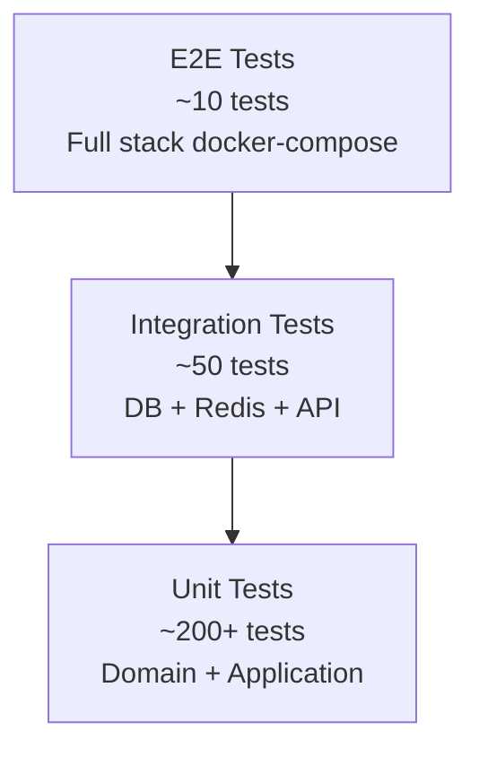

# Testing Strategy — Digital Twin Factory

## Pyramide de tests



## Structure tests/

```
tests/
├── unit/
│   ├── domain/
│   │   ├── identity/
│   │   ├── factory/
│   │   ├── simulation/
│   │   └── monitoring/
│   ├── application/
│   │   ├── commands/
│   │   └── queries/
│   └── infrastructure/
│       └── simulation/
├── integration/
│   ├── api/
│   │   ├── test_auth.py
│   │   ├── test_factories.py
│   │   ├── test_machines.py
│   │   └── test_alerts.py
│   ├── persistence/
│   │   └── test_repositories.py
│   └── tasks/
│       └── test_simulation_tasks.py
├── e2e/
│   ├── test_onboarding_flow.py
│   ├── test_simulation_live.py
│   └── test_predictive_maintenance.py
├── fixtures/
│   ├── factories.py      # Factory Boy fixtures
│   └── conftest.py       # Shared pytest fixtures
└── conftest.py
```

## Tests unitaires

**Cible :** `domain/` et `application/` — 0 dépendance infrastructure.

| Module | Tests clés |
|--------|-----------|
| `domain/factory` | Factory aggregate rules, status transitions |
| `domain/simulation` | MetricGenerator, FailureModel, degradation |
| `domain/monitoring` | Threshold checking, alert severity |
| `application/commands` | Handler logic avec mocked repositories |
| `application/queries` | Query handlers avec mocked data |

**Outils :** pytest, pytest-mock, freezegun (time), hypothesis (property-based)

**Exemples de tests domain :**
```python
# Conceptuel
def test_machine_cannot_transition_from_failure_to_running_without_maintenance():
    machine = Machine(status=MachineStatus.FAILURE)
    with pytest.raises(InvalidStatusTransition):
        machine.start()

def test_temperature_exceeds_critical_threshold_raises_critical_alert():
    rule = ThresholdRule(metric="temperature", critical=95.0)
    metrics = {"temperature": 97.0}
    assert check_threshold(rule, metrics).severity == AlertSeverity.CRITICAL

def test_failure_model_probability_increases_with_degradation():
    model = FailureModel(mtbf_hours=720)
  # After 700 hours, failure probability should be high
```

**Couverture cible :** > 90% sur `domain/` et `application/`

---

## Tests d'intégration

**Cible :** API endpoints + DB + Redis avec services réels (testcontainers ou docker-compose CI).

| Suite | Description |
|-------|-------------|
| `test_auth` | Register, login, refresh, logout, rate limit |
| `test_factories` | CRUD + tenant isolation |
| `test_machines` | CRUD + simulation start/stop |
| `test_metrics` | Historique + cache Redis |
| `test_alerts` | Threshold trigger + acknowledge |
| `test_repositories` | CRUD + RLS tenant isolation |
| `test_simulation_tasks` | Celery task avec DB réelle |

**Fixtures :**
- PostgreSQL test DB (transaction rollback per test)
- Redis test instance (flush after each test)
- Test tenant + users pré-créés

**Outils :** pytest-asyncio, httpx (AsyncClient), testcontainers

---

## Tests End-to-End

**Cible :** Flux métier complets via docker-compose.

### E2E-01 — Onboarding complet
```
Register → Login → Create Factory → Add Line → Provision Machine → Start Simulation
→ Verify metrics in DB → Verify WebSocket receives metrics
```

### E2E-02 — Alerte et notification
```
Start simulation → Wait for threshold breach → Verify alert created
→ Verify WebSocket alert event → Acknowledge alert → Verify resolved
```

### E2E-03 — Maintenance prédictive
```
Run simulation 10 min → Trigger anomaly detection → Verify prediction created
→ Verify maintenance scheduled → Complete maintenance → Machine back to RUNNING
```

**Outils :** pytest, docker-compose (CI service), websockets client

---

## CI Test Matrix

| Job | Tests | Services requis | Timeout |
|-----|-------|-----------------|---------|
| `lint` | ruff, mypy | — | 2 min |
| `test-unit` | unit/ | — | 5 min |
| `test-integration` | integration/ | postgres, redis | 15 min |
| `test-e2e` | e2e/ | full docker-compose | 30 min |
| `security` | bandit, pip-audit | — | 5 min |

## Métriques qualité

| Métrique | Cible |
|----------|-------|
| Couverture unitaire | > 90% domain + application |
| Couverture intégration | > 70% API endpoints |
| Tests E2E | 3 flux critiques |
| Temps CI total | < 45 min |
| Flaky test rate | < 1% |

## Property-based testing (simulation)

Utiliser `hypothesis` pour valider les invariants du moteur de simulation :

```python
# Conceptuel
@given(ticks=st.integers(min_value=1, max_value=1000))
def test_temperature_never_negative_after_any_ticks(ticks):
    machine = VirtualMachine(config=default_config())
    for _ in range(ticks):
        metrics = machine.tick()
        assert metrics.temperature >= 0

@given(degradation=st.floats(min_value=0, max_value=1))
def test_production_rate_decreases_with_degradation(degradation):
    ...
```
